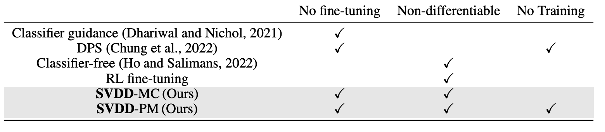
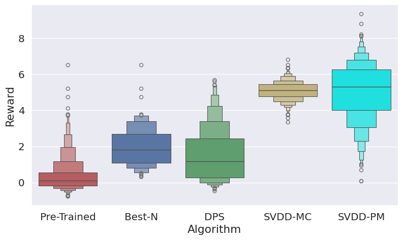
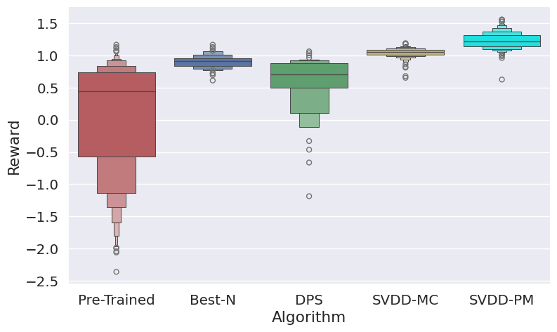

# Derivative-Free Guidance in Diffusion Models with Soft Value-Based Decoding (DNAs, RNAs)

This code accompanies [the paper](https://arxiv.org/abs/2408.08252) on soft value-based decoding in diffusion models, where the objective is to maximize downstream reward functions in diffusion models. In this implementation, we focus on designing biological sequences, such as **DNA (enhancers)** and **RNA (5'UTRs)**. For **images**, refer to [here](https://github.com/masa-ue/SVDD-image). 


We will make molecule/protein generation part publicaly available soon. The algorithm is summarized in the following table/figure.  


 


## Design of Enhancers 

We prepared the pre-trained model using the masked diffusion model [Sahoo et.al, 2024](https://arxiv.org/abs/2406.07524) and the dataset in [Gosai et al., 2023](https://pubmed.ncbi.nlm.nih.gov/37609287/). We aim to generate natural enhancers with higher activities in HepG2 with soft-value based decoding. The first one is SVDD-MC. The second one corresponds to SVDD-PM. Then, generated $r$'s are saved in the log folder. Regarding evaluation of generated samples, you could refer to `eval_simple.ipynb` 

`CUDA_VISIBLE_DEVICES=1 python decode.py --load_checkpoint_path artifacts/DNA_value:v0/human_enhancer_diffusion_enformer_7_11_1536_16_ep10_it3500.pt --task dna --sample_M 10`


`CUDA_VISIBLE_DEVICES=2 python decode_tweedie.py --load_checkpoint_path artifacts/DNA_value:v0/human_enhancer_diffusion_enformer_7_11_1536_16_ep10_it3500.pt --task dna --sample_M 10 --tweedie True`


 

## Design of 5'UTRs  

We prepared the pre-trained model using the masked diffusion model [Sahoo et.al, 2024](https://arxiv.org/abs/2406.07524) and the dataset in [Sample et al., 2019](https://www.ncbi.nlm.nih.gov/geo/query/acc.cgi?acc=GSE114002). We aim to generate natural enhancers with higher activities in HepG2 with soft-value based decoding. The first one is SVDD-MC. The second one corresponds to SVDD-PM. Then, generated $r$'s are saved in the log folder. Regarding evaluation of generated samples, you could refer to `eval_simple.ipynb` 


`CUDA_VISIBLE_DEVICES=3 python decode.py --load_checkpoint_path artifacts/RNA_MRL_value:v0/rna_MRL_diffusion_convgru_6_64_512_ep10_it2800.pt  --reward_name MRL --task rna --sample_M 10`

`CUDA_VISIBLE_DEVICES=1 python decode_tweedie.py --load_checkpoint_path artifacts/RNA_MRL_value:v0/rna_MRL_diffusion_convgru_6_64_512_ep10_it2800.pt --reward_name MRL --task rna --sample_M 10  --tweedie True`

 

## Instllation & Preparation 

Run 
```
conda create -n biodif python=3.9
conda activate biodif
pip install -r requirements.txt 
`
```
Then, to get pre-trained diffusoin models/oracles from W&B, run 
```
python allmodels/model_load.py
```